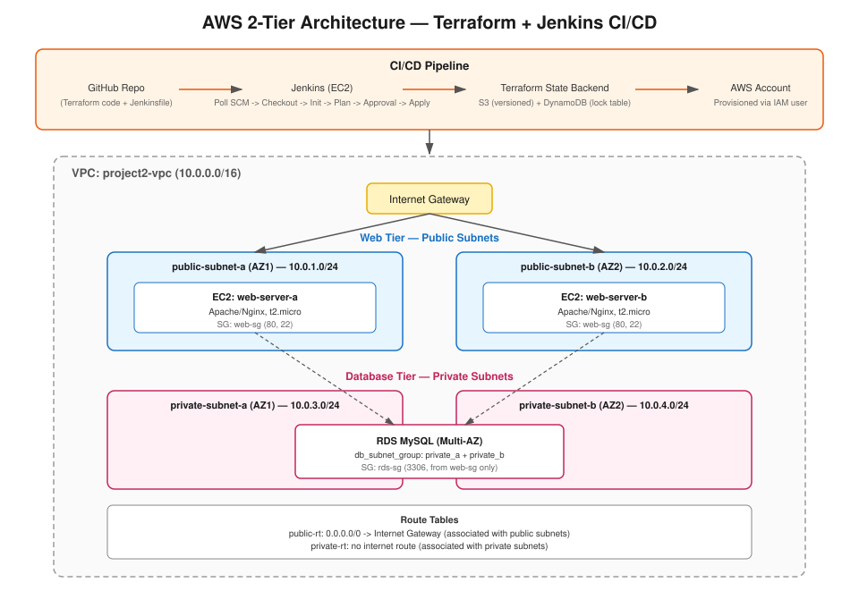

# AWS 2-Tier Architecture with Terraform & Jenkins CI/CD

A complete Infrastructure-as-Code project provisioning a highly available
2-tier AWS architecture (Web + Database) using **Terraform**, automated
through a **Jenkins** pipeline, with remote state managed in **S3 +
DynamoDB**.

## Architecture



```
GitHub Repo (Terraform + Jenkinsfile)
        |
        v
Jenkins (EC2) --- Poll SCM --- Checkout --- Init --- Plan --- Approval --- Apply
        |
        v
Terraform State: S3 (versioned) + DynamoDB (lock table)
        |
        v
AWS 2-Tier Architecture
  Custom VPC (10.0.0.0/16)
   |-- Public Subnet A (AZ1) -> EC2 web-server-a (Apache/Nginx)
   |-- Public Subnet B (AZ2) -> EC2 web-server-b (Apache/Nginx)
   |-- Private Subnet A (AZ1) -\
   |-- Private Subnet B (AZ2) ---> RDS MySQL (Multi-AZ)
```

## Tech Stack

| Layer | Tool |
|---|---|
| IaC | Terraform (~> 5.0 AWS provider) |
| CI/CD | Jenkins (Pipeline, Poll SCM) |
| Compute | EC2, Amazon Linux 2023, t2.micro |
| Database | RDS MySQL 8.0, db.t3.micro, Multi-AZ |
| Networking | Custom VPC, 2 public + 2 private subnets, IGW, route tables |
| State backend | S3 (versioned) + DynamoDB (state locking) |
| Version control | GitHub |

## Repo Structure

```
.
├── README.md
├── DOCUMENTATION.md          # Full implementation write-up
├── docs/
│   └── architecture.svg
├── Jenkinsfile
├── provider.tf
├── backend.tf
├── variables.tf
├── vpc.tf
├── security_groups.tf
├── ec2.tf
├── rds.tf
└── outputs.tf
```

See [`DOCUMENTATION.md`](DOCUMENTATION.md) for the full step-by-step
implementation, screenshots guidance, troubleshooting notes, and cleanup
steps.

## Quick Start

1. Create the S3 bucket + DynamoDB table (remote state backend) — see Part I in `DOCUMENTATION.md`
2. Update `backend.tf` with your bucket name and region
3. Push this repo to GitHub
4. Launch a Jenkins EC2 instance and configure the pipeline job (Part II)
5. Trigger the pipeline: Checkout -> Init -> Plan -> **manual approval** -> Apply
6. Verify resources in the AWS Console
7. When done, run `terraform destroy` to tear everything down and avoid charges

## Pipeline Stages

| Stage | Purpose |
|---|---|
| Checkout Code | Pulls the latest Terraform code from GitHub |
| Setup Terraform Environment | Confirms Terraform is installed and available |
| Terraform Init | Connects to the S3/DynamoDB backend, downloads providers |
| Terraform Plan | Computes the execution plan (resources to add/change/destroy) |
| Approval | Manual gate — pipeline pauses until a human clicks Apply |
| Terraform Apply | Provisions the actual AWS resources |

## Security Notes

- The RDS instance has `publicly_accessible = false` and only accepts
  inbound MySQL traffic (port 3306) from the **web tier's security
  group**, not from the internet.
- Private subnets have no route to the Internet Gateway, keeping the
  database tier network-isolated.
- AWS credentials are injected into Jenkins via encrypted "Secret text"
  credentials, never hardcoded in the pipeline or Terraform files.
